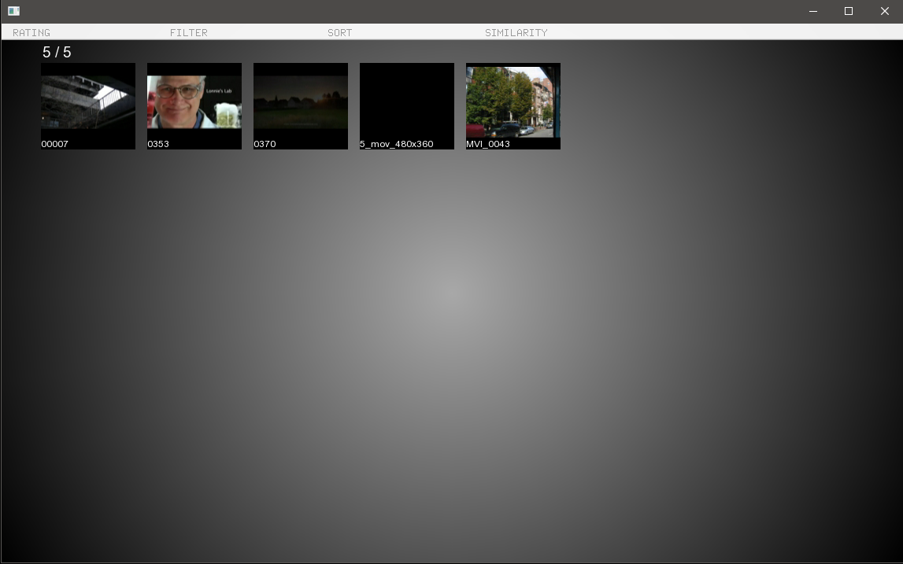

# Graphical Interface Instructions

In this project github repository there is a Visual Studio Project. One can either compile it from source or just copy and paste the binaries from the bin folder to any place on a windows x64 machine and then, run the executable video-assessment.exe The fastest way to solve missing video codecs error is to install K-lite codec pack 12.3.0.

When starting the application, as we can see in image 1, the gui present us with the thumbnails of all the videos in the repository. In this case is the starting demonstration repository made with one second of each of the 700 videos of the CERTH-ITI-VAQ700 aesthetics dataset.


## Development setup

* Windows 10
* Visual Studio community edition 2015
* openFrameworks 0.9.3
* OpenCV 3.2.0 + contrib modules

The available binaries should run on any Windows 8-10. x64 machine. To run, just copy the bin folder to local machine and run the executable video-assessment.exe
The fastest way to solve missing video codecs error is to install [K-lite codec pack 12.3.0.](https://k-lite-mega-codec-pack.en.uptodown.com/windows/download/791979)

## Using the interface

When one of the thumbnails is clicked, as we can see in image 2, the gui marks the selected video with a green border and present us in its rigth side with a metadata panel and below it a preview panel with the selected video. Pressing the spacebar toggles between preview play and stop.


#### Menus

There are 4 available menu tabs:

* RATING - With the rating tabthe user can assign a rating from 0 to 5 to some videos and afterwards filter or sort by this rating.
* FILTER 1 - In the filter tab 1 the user can filter using the basic features.
* FILTER 2 - In the filter tab 2 are grouped more advanced features.
* SORT - In this tab we can sort the videos by more then 20 different features.
* SIMILARITY - Using the similarity menu the user can generate a similarity index based on color, edge orientation, entropy or motion. This feature uses the current selected video as reference for the indexing operation. After generation of the index the user can sort by similarity using the sort tab.

## Adding a new video repository

The extractor class accepts 3 types of video file extensions:

* MP4
* MTS
* MOV

To add a new repository of videos:

* Delete all files in “data/xml” folder
* Delete all files in “data/thumbnails/videos” folder (optional step)
* Delete all files in “data/files” folder
* Put new video files in “data/files” folder
* Start application

Example:

* After deleting all files in “data/xml” folder we copied 5 videos to “data/files” folder

 

* Runing the application renders this output

 

* After the feature extraction process the graphical interface starts up

 

## Changing extraction setup

It is possible to configure the feature extraction using the extractor_config.xml file, below is
the content of this file where we can see the default values:

```
<CONFIG>
	<SAMPLING_FACTOR>1</SAMPLING_FACTOR>
	<EDGE_HIST>1</EDGE_HIST>
	<ENTRO>0</ENTRO>
	<QUIET>1</QUIET>
	<RESIZE>1</RESIZE>
	<BGSUB>1</BGSUB>
	<FLOW>1</FLOW>
	<PARSE_ONLY>0</PARSE_ONLY>
	<INPUT_FOLDER>data/files/</INPUT_FOLDER>
	<TOTAL_FILES>1000</TOTAL_FILES>
</CONFIG>
```
These are experimental configurable values, it is not advisable to change them.

#### SAMPLING_FACTOR = [positive integer] 
Increasing the sampling factor will skip frames during the extraction process, making it much
faster to compute. Extracting our features using a factor of 10 means that the time of the
extraction process will be 1/10 of using a factor of 1.There is a drawback, background
subtraction and optical flow features will not be extracted.

#### EDGE_HIST = [0, 1] 
Turning off edge histogram will decrease sligthly computation time.

#### ENTRO = [0, 1] 
Entropy computation switch for debug.

#### QUIET = [0, 1] 
Turning off quiet mode will increase console feed-back from extraction process.

#### RESIZE = [1, 2, 3]
 The extraction process is done on a resized version of the video frames, available options are:

* 0 - no resizing
* 1 - 320 x 240
* 2 - 480 x 360
* 3 - 640 x 480

#### BGSUB = [0, 1] 
Computation of background subtraction features.

#### FLOW = [0, 1] 
Computation of optical flow features

#### PARSE_ONLY = [0, 1] 
Allows to bypass extraction process and start from feature vector parse phase.

#### INPUT_FOLDER = [string] 
The path to folder with input videos.

#### TOTAL_FILES = [positive integer] 
The total capacity.


## Error handling

The error handling and exception mechanism is not enough implemented, if the application hangs at the extraction phase, theres a great probability of existance of corrupted video files, you can inspect the output/output.csv file to try to understand wich is the damaged file and delete/recode it. When errors occur during very long extraction operations it is possible to reuse the already extracted data.

* backup the output.csv file
* delete/move the already computed videos
* restart the extraction process
* in the end concatenate all output.csv files
* put correct video file set in data/files folder (they should correspond to the thumbnails)
* change PARSE_ONLY to 1 (to bypass extraction process)
* xml folder should be empty
* restart the application
* after creation of XML files the GUI will start
* At this point switch PARSE_ONLY to 0. (back to default value)